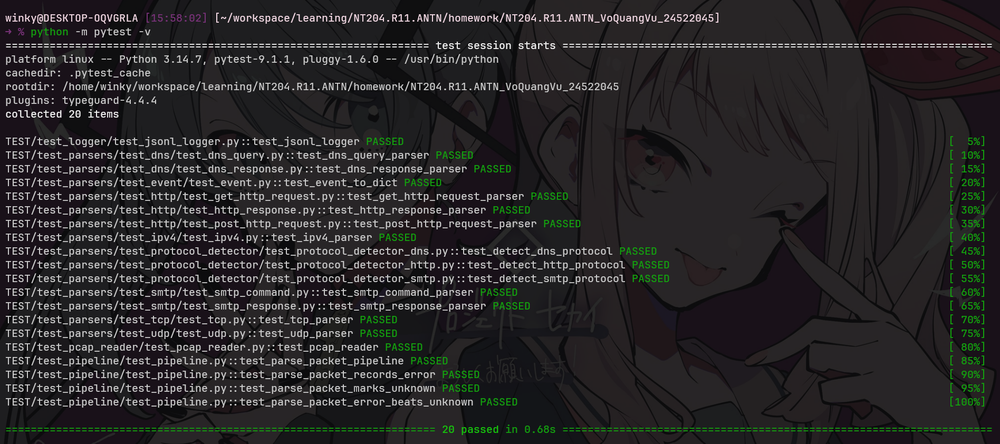

# NT204.R11.ANTN

Bài tập xây dựng module Packet Capture & Parser cho hệ thống IDS.

## Yêu cầu và cài đặt package

```bash
python3 -m venv .venv
source .venv/bin/activate
pip install -r requirements.txt
```

## Sử dụng

Live capture từ network interface:

```bash
python main.py --interface eth0
python main.py --interface wlan0
```

Đọc packet từ file PCAP:

```bash
python main.py --pcap files/input/test1.pcap
```

Mặc định chương trình in output ra stdout, để in ra file:

```
python main.py --interface eth0 --output file
```


## Pipeline

```
Raw Packet -> Network Parser -> Transport Parser -> Application Protocol Detector -> Application Protocol Parser -> Normalized IDS Event
```

Protocol hỗ trợ: IPv4, TCP, UDP, HTTP, DNS, SMTP. Packet ngoài danh sách này được đánh dấu `status` là `UNKNOWN`

## Kiểm thử

```bash
python -m pytest -v
```


